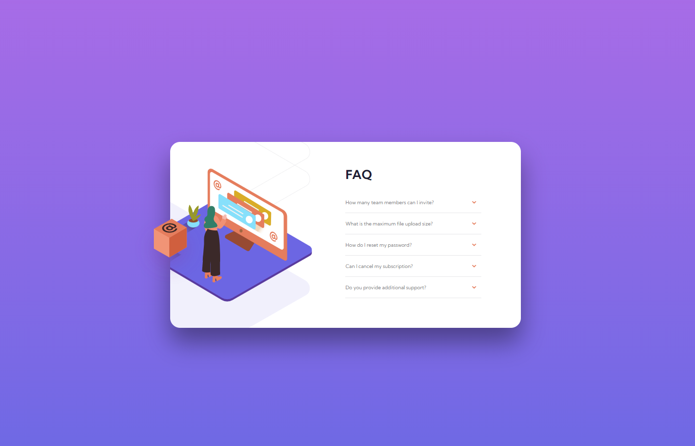

# Frontend Mentor - FAQ accordion card solution

This is a solution to the [FAQ accordion card challenge on Frontend Mentor](https://www.frontendmentor.io/challenges/faq-accordion-card-XlyjD0Oam). Frontend Mentor challenges help you improve your coding skills by building realistic projects. 

## Table of contents

- [Overview](#overview)
  - [The challenge](#the-challenge)
  - [Screenshot](#screenshot)
  - [Links](#links)
- [My process](#my-process)
  - [Built with](#built-with)
- [Author](#author)

## Overview

### The challenge

Users should be able to:

- ✔️ View the optimal layout for the component depending on their device's screen size
- ✔️ See hover states for all interactive elements on the page
- ✔️ Hide/Show the answer to a question when the question is clicked
- ✔️ **Bonus**: Complete the challenge without using JavaScript

### Screenshot

### Links

- Solution URL: [Frontend Mentor URL](https://www.frontendmentor.io/challenges/faq-accordion-card-XlyjD0Oam/hub/faq-accordion-card-FIBN5byHSI)
- Live Site URL: [Github Pages URL](https://frontend-mentor-tasks.github.io/faq-accordion-card/)
- Code URL: [Github URL](https://github.com/frontend-mentor-tasks/faq-accordion-card)

## My process

### Built with

- Semantic HTML5 markup
- Mobile-first workflow

## Author

- Website - [Sune Seifert](https://bqardi.dk)
- Frontend Mentor - [@bqardi](https://www.frontendmentor.io/profile/bqardi)
